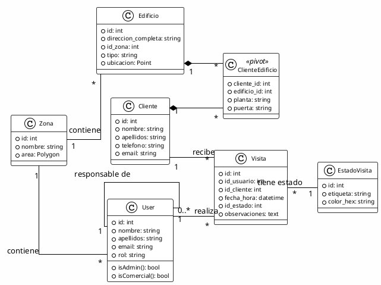

<h1 align="center">LeadChain API - Backend Córdoba</h1>

**LeadChain** es una solución backend RESTful de alto rendimiento diseñada específicamente para la gestión inteligente de carteras de clientes, edificios y visitas comerciales en la ciudad de Córdoba.

Lo que hace única a esta API es su integración profunda con **PostgreSQL y la extensión PostGIS**. Esta arquitectura permite que LeadChain no solo almacene datos, sino que comprenda la ubicación espacial: puede validar si un comercial está dentro de su zona asignada, ubicar edificios en un mapa con precisión milimétrica y optimizar rutas de venta basadas en coordenadas geográficas reales.

<h2 align="center">Guía de Despliegue</h2>

Para poner en marcha el proyecto, elige una de las dos opciones disponibles según tu entorno.

---

<h3 align="center">Opción A: Docker (Recomendado)</h3>

<h4 align="center">Requisitos para Opción A</h4>

- [Docker Desktop](https://www.docker.com/products/docker-desktop/): Esencial para la contenerización. Docker permite que la API y la base de datos corran en un entorno idéntico al de producción.
- [Git](https://git-scm.com/): Para la clonación y gestión del código fuente.

<h4 align="center">Pasos de Instalación con Docker</h4>

Este método es el más limpio, ya que Docker se encarga de configurar PostGIS y PHP por ti de forma totalmente aislada.

1. **Clonar el repositorio:**

   ```bash
   git clone https://github.com/AlbertoRomeroPino/Leadchain-backend.git
   cd leadchain-backend
   ```
2. **Levantar los contenedores con un comando:**
   Aqui puedes hacer 2 opciones:

   ```bash
   composer install
   php artisan start:complete

   -------------------------------------------------------------------

   docker compose up -d --build
   # para las migraciones tienes que pararte un poco tras ejecutar el --build o te dara fallo
   docker compose exec -T app php artisan migrate --force
   docker compose exec -T app php artisan db:seed --force
   ```

   Este comando se encarga de todo: construye imágenes, levanta contenedores, ejecuta migraciones y carga datos iniciales.
3. **Acceso a la API:**

   - Swagger: `http://localhost:8000/api/documentation`
   - API raíz: `http://localhost:8000`

---

<h3 align="center">Opción B: Instalación Local / Nativa</h3>

<h4 align="center">Requisitos para Opción B</h4>

- **PHP 8.2 o superior**: Motor del lenguaje. Asegúrate de que en tu `php.ini` estén activas las extensiones `extension=sodium` (cifrado de tokens) y `extension=pdo_pgsql` (comunicación con PostgreSQL dockerizado).
- [Composer](https://getcomposer.org/): Gestor de dependencias de PHP.
- [Docker Desktop](https://www.docker.com/products/docker-desktop/): Solo para dockerizar la BD (PostgreSQL + PostGIS). Laravel corre local.

<h4 align="center">Pasos de Instalación Local</h4>

Sigue estos pasos si prefieres ejecutar Laravel de forma nativa mientras usas Docker únicamente para la base de datos (Modo Híbrido).

1. **Preparar el código:**

   ```bash
   git clone https://github.com/AlbertoRomeroPino/Leadchain-backend.git
   cd leadchain-backend
   ```
2. **Instalar las dependencias y configurar entorno:**

   ```bash
   # Instalar librerías de Laravel
   composer install

   # Configurar archivo de entorno
   cp .env.example .env

   # Generar claves de seguridad
   php artisan key:generate
   php artisan jwt:secret
   ```
3. **Iniciar desarrollo con un comando:**

   ```bash
   php artisan start:hybrid
   ```

   Este comando levanta la BD en Docker, ejecuta migraciones, seeders y arranca el servidor local automáticamente.

   Acceso: `http://127.0.0.1:8000/api/documentation` (Swagger)

---

<h2 align="center">Modelo de Accesos y Permisos</h2>

La seguridad se gestiona mediante **JWT (JSON Web Tokens)**. El sistema implementa una lógica de roles estricta:

| Recurso                 | Administrador | Comercial   | Notas de Privacidad                                        |
| :---------------------- | :------------ | :---------- | :--------------------------------------------------------- |
| **Clientes**      | CRUD          | R (Lectura) | Los comerciales ven sus clientes pero no pueden borrarlos. |
| **Zonas**         | CRUD          | R (Lectura) | Gestión geográfica reservada a gerencia.                 |
| **Usuarios**      | CRUD          | -           | Datos de empleados privados.                               |
| **Edificios**     | CRUD          | R (Lectura) | Catálogo de puntos de interés comercial.                 |
| **Visitas**       | R / D         | C / R / U   | Gestión diaria de actividad comercial.                    |
| **Estado Visita** | R (Lectura)   | R (Lectura) | Flujo de estados (Pendiente, Éxito, etc).                 |

---

<h2 align="center">Comandos Personalizados</h2>

Este proyecto incluye cuatro comandos Artisan customizados para facilitar el desarrollo y despliegue:

<h3 align="center"> 1. php artisan start:complete </h3>

**Propósito:** Levanta el stack completo (app + BD) usando Docker Compose.

**Qué hace:**

- Ejecuta `docker compose up -d --build` para construir y levantar todos los contenedores.
- Espera a que el contenedor app esté completamente inicializado (artisan listo, vendor instalado).
- Ejecuta automáticamente `php artisan migrate --force` dentro del contenedor.
- Ejecuta automáticamente `php artisan db:seed --force` para cargar datos iniciales.

**Cuándo usarlo:** Primera vez que necesites levantar el proyecto completo en Docker o tras un `docker compose down -v`.

**Ejemplo:**

```bash
php artisan start:complete
```

---

<h3 align="center"> 2. php artisan start:hybrid </h3>

**Propósito:** Arranca la BD en Docker y la API en tu máquina local (Modo Híbrido).

**Qué hace:**

- Levanta solo el contenedor PostgreSQL con `docker compose up -d db`.
- Espera a que PostgreSQL esté completamente listo y funcional.
- Configura automáticamente `DB_HOST=127.0.0.1` para que Laravel local pueda conectar.
- Ejecuta `php artisan migrate --force` con reintentos automáticos (tolera fallos transitorios).
- Ejecuta `php artisan db:seed --force` para cargar datos iniciales.
- Limpia cachés con `php artisan optimize:clear`.
- Arranca el servidor local en `http://127.0.0.1:8000`.

**Ventajas:** Mejor para desarrollo local, más rápido que Docker completo, acceso directo a logs sin contenedor.

**Ejemplo:**

```bash
php artisan start:hybrid
```

---

<h3 align="center">3. php artisan retest </h3>

**Propósito:** Ejecuta automáticamente el flujo completo de pruebas (reset + seed + tests).

**Qué hace:**

- Limpia la BD con `php artisan migrate:refresh` (borra todos los datos).
- Carga datos de prueba con `php artisan db:seed`.
- Ejecuta todos los tests unitarios y de feature con `php artisan test`.

**Cuándo usarlo:** Antes de mergear cambios, para asegurar que nada está roto.

**Ejemplo:**

```bash
php artisan retest
```

---

<h3 align=center>4. php artisan api:tree</h3>

**Propósito:** Visualiza la estructura y endpoints de la API de forma simplificada.

**Qué hace:**

- Muestra un árbol de rutas organizadas jerárquicamente.
- Indica método HTTP (GET, POST, PUT, DELETE).
- Agrupa por controlador.

**Cuándo usarlo:** Para documentar rápidamente o explorar los endpoints sin abrir el Swagger.

**Ejemplo:**

```bash
php artisan app:tree
```

---

<h2 align="center">Estructura del Sistema </h2>

```bash
Estructura del proyecto (filtrada):
├── .dockerignore
├── .env
├── .env.example
├── README.md
├── app
│   ├── Console
│   │   └── Commands
│   │       ├── EstructuraProyecto.php
│   │       ├── ResetAndTest.php
│   │       ├── StartComplete.php
│   │       └── StartHybrid.php
│   ├── Http
│   │   ├── Controllers
│   │   │   ├── Api
│   │   │   │   └── AuthController.php
│   │   │   ├── ClienteController.php
│   │   │   ├── Controller.php
│   │   │   ├── EdificioController.php
│   │   │   ├── EstadoVisitaController.php
│   │   │   ├── UserController.php
│   │   │   ├── VisitaController.php
│   │   │   └── ZonaController.php
│   │   ├── Middleware
│   │   │   ├── CheckRole.php
│   │   │   └── LoginAdmin.php
│   │   ├── Requests
│   │   │   ├── AuthRequest.php
│   │   │   ├── ClienteRequest.php
│   │   │   ├── EdificioRequest.php
│   │   │   ├── UserRequest.php
│   │   │   ├── UserUpdateRequest.php
│   │   │   ├── VisitaRequest.php
│   │   │   └── ZonaRequest.php
│   │   └── Resources
│   │       ├── ClienteResource.php
│   │       ├── EdificioResource.php
│   │       ├── EstadoVisitaResource.php
│   │       ├── UserResource.php
│   │       ├── VisitaResource.php
│   │       └── ZonaResource.php
│   ├── Models
│   │   ├── Cliente.php
│   │   ├── Edificio.php
│   │   ├── EstadoVisita.php
│   │   ├── User.php
│   │   ├── Visita.php
│   │   └── Zona.php
│   └── OpenApi
│       └── OpenApiSpec.php
├── config
│   ├── auth.php
│   ├── cors.php
│   ├── jwt.php
│   └── l5-swagger.php
├── database
│   ├── migrations
│   │   ├── 2026_03_09_000001_create_zonas_table.php
│   │   ├── 2026_03_09_000002_create_estados_visita_table.php
│   │   ├── 2026_03_09_000003_create_users_table.php
│   │   ├── 2026_03_09_000006_create_clientes_table.php
│   │   ├── 2026_03_09_000007_create_edificios_table.php
│   │   ├── 2026_03_09_000008_create_visitas_table.php
│   │   └── 2026_03_19_000010_convert_zonas_points_to_polygon.php
│   └── seeders
│       ├── ClienteSeeder.php
│       ├── DatabaseSeeder.php
│       ├── EdificioSeeder.php
│       ├── EstadoVisitaSeeder.php
│       ├── UserSeeder.php
│       ├── VisitaSeeder.php
│       └── ZonaSeeder.php
├── docker-compose.yml
├── dockerfile
├── routes
│   ├── api.php
│   ├── console.php
│   └── web.php
└── tests
    ├── Feature
    │   ├── ClienteTest.php
    │   ├── EdificioTest.php
    │   ├── LoginTest.php
    │   ├── UserTest.php
    │   ├── VisitasTest.php
    │   └── ZonaTest.php
    └── Fixture
        ├── ClienteData.php
        ├── EdificioData.php
        ├── LoginData.php
        ├── UserData.php
        ├── VisitasData.php
        └── ZonaData.php
```

---

<h2 align="center">Autor</h2>

- **Alberto Romero Pino**
- **Email**: albertoromeropino2004@gmail.com
- **LinkedIn**: [linkedin.com/in/alberto-romero-pino-8aa0a32ba](linkedin.com/in/alberto-romero-pino-8aa0a32ba)

---

<h2 align="center"> Diagrama de clases</h2>



---

<h1 align="center">Soluciones a problemas</h1>

1º Windows estaba sobreponiendose al puerto de postman y no me dejaba hacer un start:complete. Lo que se realiza aqui es para el servicio que ocupa el puerto tirar la base de datos y luego activar el que habia parado para que cambie de puerto

```powershell
# 1. Detener el servicio que gestiona el NAT y las reservas de puertos
net stop winnat

# 2. Levanta tu contenedor de Docker (ahora debería dejarte usar el puerto 5432)
# docker-compose up -d (o el comando que uses)

# 3. Volver a iniciar el servicio
net start winnat
```
