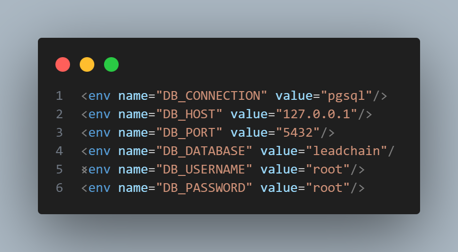

# //TODO Alberto esto es un boceto para modificar mas adelante

# LeadChain API - Backend Córdoba

LeadChain es una **API-Rest** diseñada para la gestión de clientes, edificios y visitas comerciales en la ciudad de Córdoba. Utiliza **PostgreSQL con PostGIS** para manejar ubicaciones geográficas exactas, permitiendo visualizar mapas y zonas de venta en tiempo real.

---

## Tecnologías utilizadas

* **Lenguaje:** PHP 8.x (Laravel Framework)
* **Base de Datos:** PostgreSQL 15 + PostGIS (Extensión espacial)
* **Contenedores:** Docker & Docker Compose
* **Gestión de BD:** DBeaver (Recomendado)

---

## Instalación y Despliegue

Sigue estos pasos para tener el entorno funcionando en menos de 5 minutos:

### 1. Requisitos Previos

Asegúrate de tener instalados:

* [Docker Desktop](https://www.docker.com/products/docker-desktop/)
* [Git](https://git-scm.com/)
* [Composer](https://getcomposer.org/)

Comprueba que php.ini tenga descomentado las lineas:

- `extension=sodium`
- `extension=pdo_pgsql`

> ⚠️ Descomentado significa sin el `;` delante

### 2. Clonar y Preparar el Proyecto

```bash
# Clonar el repositorio
git clone https://github.com/AlbertoRomeroPino/Leadchain-backend.git
cd leadchain-backend

# Instalar dependencias de PHP
composer install
```

### 3. Configurar Entorno y Seguridad

Copia el archivo de `.env.example`, modificalo a `.env` y genera las claves necesarias:

```bash
cp .env.example .env

# Generar clave de la aplicación y el secreto para JWT
php artisan key:generate
php artisan jwt:secret
```

**Verificación en el `.env`:**
Asegúrate de que las variables de la base de datos coincidan con el entorno Docker y que el algoritmo JWT sea el correcto:

**Fragmento de código**

```
DB_CONNECTION=pgsql
DB_HOST=127.0.0.1
DB_PORT=5432
DB_DATABASE=leadchain
DB_USERNAME=root
DB_PASSWORD=root

JWT_ALGO=HS256
```

### 4. Levantar la infraestructura (Docker)

Este comando levanta el contenedor de **PostgreSQL/PostGIS** necesario para el almacenamiento de datos geográficos.

**Bash**

```
docker-compose up -d
```

> **Nota sobre persistencia:** Si decides descomentar la sección de `volumes` en tu `docker-compose.yml`, los datos se mantendrán aunque borres el contenedor. Si usas el script de inicialización automático (`init-db`), es posible que no necesites el siguiente paso.

### 5 Lanzar migraciones, seeder y test

Esto no es un comando nativo pero lo e creado para lanzarlo. Esto realiza las 3 acciones al mismo tiempo y te muestra si los test a finalizado correctamente.

```bash
php artisan retest
```

### 6. Ejecutar la API

Una vez que la base de datos está lista y las dependencias instaladas, puedes poner en marcha el servidor de desarrollo:

**Bash**

```
php artisan serve
```

La API estará disponible en: `http://127.0.0.1:8000`

---

## Conexión a la Base de Datos

Para gestionar los datos y ver los  **mapas de Córdoba** , conecta **DBeaver** con los siguientes datos:

* **Host:** `localhost`
* **Puerto:** `5432`
* **Base de datos:** `leadchain`
* **Usuario:** `root`
* **Contraseña:** `root`

---

## Comando creado

Creado para poder hacer una estrutura de proyecto personalizada para mostrar los apartados que yo queria y quitar los inecesario.

```bash
php artisan api:tree
```

Comando que resetea la base de datos, ejecuta Seeders y lanza los tests

```bash
php artisan retest
```

---

## Permisos de usuario

CRUD = Create, Read, Update, Delete

|  Recurso  |  Admin  | Comercial |
| :-------: | :-----: | :-------: |
| Clientes |  CRUD  |  - R - -  |
|   Zonas   |  CRUD  |  - R - -  |
| Usuarios |  CRUD  |  - - - -  |
| Edificios |  CRUD  |  - R - -  |
|  Visitas  | - R - D |  C-R-U -  |

---

## Postman:

|    Header    |                                          |
| :-----------: | :--------------------------------------: |
| Content-Type |             application/json             |
| Authorization |                                          |
| Bearer Token | Token recibido cuando se manda el login. |

POST: `http://127.0.0.1:8000/api/auth/login`

## Endpoints Principales (API)

La API responde en formato JSON. Algunos de los recursos disponibles son:

`http://127.0.0.1:8000`

### Ruta de login

| **Método** | **Endpoint**  |       **Descripción**       | Body                                                                 | Token |
| :---------------: | ------------------- | :---------------------------------: | -------------------------------------------------------------------- | ----- |
|       POST       | `/api/auth/login` | Iniciar sesión y obtener token JWT | {<br />"email": "root@leadchain.com",<br />"password": "root"<br />} | NO    |

### Rutas protegidas con JWT.

Cada vez que se use logout o refresh va a hacer falta modificar los tokens guardados en `Bearer Token` de todos.

| **Método** | **Endpoint**    |        **Descripción**        | Body     | Token |
| :---------------: | --------------------- | :-----------------------------------: | -------- | ----- |
|       POST       | `/api/auth/logout`  |   Cerrar sesión e invalidar token   | No tiene | SI    |
|       POST       | `/api/auth/refresh` |          Refrescar token JWT          | No tiene | SI    |
|        GET        | `/api/auth/me`      | Obtener datos del usuario autenticado | No tiene | SI    |

### Rutas compartidas por ambos roles (comercial - administrador)

| Método | Endpoint                         |        Descripción        | Body     | Token |
| :-----: | -------------------------------- | :------------------------: | -------- | ----- |
|   GET   | `/api/clientes`                | Listar todos los clientes | No tiene | SI    |
|   GET   | `/api/clientes/{id_cliente}`   | Obtener un cliente por ID | No tiene | SI    |
|   GET   | `/api/zonas`                   |   Listar todas las zonas   | No tiene | SI    |
|   GET   | `/api/zonas/{id_zona}`         |  Obtener una zona por ID  | No tiene | SI    |
|   GET   | `/api/edificios`               | Listar todos los edificios | No tiene | SI    |
|   GET   | `/api/edificios/{id_edificio}` | Obtener un edificio por ID | No tiene | SI    |
|   GET   | `/api/visitas`                 |  Listar todas las visitas  | No tiene | SI    |
|   GET   | `/api/visitas/{id_visita}`     | Obtener una visita por ID | No tiene | SI    |

### Rutas del comercial (anunciante)

| Método | Endpoint                     |            Descripción            | Body                                                                                                                                                                                                                                                     | Token      |
| :-----: | ---------------------------- | :--------------------------------: | -------------------------------------------------------------------------------------------------------------------------------------------------------------------------------------------------------------------------------------------------------- | ---------- |
|  POST  | `/api/visitas`             |       Crear una nueva visita       | {<br />      "id_usuario": 2,<br />      "id_cliente": 1,<br />      "fecha_hora": "2026-03-15 10:30:00",<br />      "id_estado": 1,<br />      "observaciones": "Primera visita al cliente"<br />}                                      | Anunciante |
|   PUT   | `/api/visitas/{id_visita}` |   Actualizar una visita completa   | {<br />      "id_usuario": 2,<br />      "id_cliente": 1,<br />      "fecha_hora": "2026-03-15 11:00:00",<br />      "id_estado": 2,<br />      "observaciones": "El cliente no estaba, se reprogramó para media hora después."<br />} | Anunciante |
|  PATCH  | `/api/visitas/{id_visita}` | Actualizar parcialmente una visita | Es lo mismo que el PUT solo que puedes elegir los campos que quieres<br /> modificar sin tener que mandar el objeto completo<br />Ej1:<br />{<br />      "id_estado":2<br />}<br />Ej2:{<br />      "observaciones": "Cualquier cosa"<br />}       | Anunciante |

### Rutas del administrador

| Método |             Endpoint             |            Descripción            | Body                                                                                                                                                                                                                                                                | Token         |
| :-----: | :------------------------------: | :---------------------------------: | ------------------------------------------------------------------------------------------------------------------------------------------------------------------------------------------------------------------------------------------------------------------- | ------------- |
|  POST  |          `/api/zonas`          |        Crear una nueva zona        | {<br />"nombre_zona": "Zona Norte",<br />"esquina_noroeste": {"lat": 37.90, "lng": -4.80},<br />"esquina_noreste": {"lat": 37.90, "lng": -4.75},<br />"esquina_suroeste": {"lat": 37.87, "lng": -4.80},<br />"esquina_sureste": {"lat": 37.87, "lng": -4.75}<br />} | Administrador |
|   PUT   |     `/api/zonas/{id_zona}`     |    Actualizar una zona completa    | Mismo body que POST con todos los campos                                                                                                                                                                                                                            | Administrador |
| DELETE |     `/api/zonas/{id_zona}`     |          Eliminar una zona          | No tiene                                                                                                                                                                                                                                                            | Administrador |
|   GET   |          `/api/users`          |      Listar todos los usuarios      | No tiene                                                                                                                                                                                                                                                            | Administrador |
|   GET   |       `/api/users/{id}`       |      Obtener un usuario por ID      | No tiene                                                                                                                                                                                                                                                            | Administrador |
|  POST  |          `/api/users`          |       Crear un nuevo usuario       | {<br />"nombre": "Alejandro",<br />"apellidos": "García Martínez",<br />"email": "ale.garcia@email.com",<br />"password": "password1234",<br />"rol": "comercial",<br />"id_responsable": 1,<br />"id_zona": 2<br />}                                             | Administrador |
|   PUT   |       `/api/users/{id}`       |   Actualizar un usuario completo   | Mismo body que POST con todos los campos                                                                                                                                                                                                                            | Administrador |
|  PATCH  |       `/api/users/{id}`       | Actualizar parcialmente un usuario | Solo los campos a modificar.<br />Ej: {<br />"nombre": "Carlos Editado"<br />}                                                                                                                                                                                      | Administrador |
| DELETE |       `/api/users/{id}`       |         Eliminar un usuario         | No tiene                                                                                                                                                                                                                                                            | Administrador |
|  POST  |        `/api/clientes`        |       Crear un nuevo cliente       | {<br />"nombre": "Antonio",<br />"apellidos": "Pérez García",<br />"telefono": "612345678",<br />"email": "antonio@ejemplo.com",<br />"id_usuario_asignado": 2<br />}                                                                                             | Administrador |
|   PUT   |  `/api/clientes/{id_cliente}`  |   Actualizar un cliente completo   | Mismo body que POST con todos los campos                                                                                                                                                                                                                            | Administrador |
|  PATCH  |  `/api/clientes/{id_cliente}`  | Actualizar parcialmente un cliente | Solo los campos a modificar.<br />Ej: {<br />"telefono": "698765432"<br />}                                                                                                                                                                                         | Administrador |
| DELETE |  `/api/clientes/{id_cliente}`  |         Eliminar un cliente         | No tiene                                                                                                                                                                                                                                                            | Administrador |
|  POST  |        `/api/edificios`        |       Crear un nuevo edificio       | {<br />"direccion_completa": "Calle Gran Capitán 10",<br />"planta": "3",<br />"puerta": "A",<br />"ubicacion": { "lat": 40.4168, "lng": -3.7038 }<br />"id_zona": 1,<br />"tipo": "residencial",<br />"id_cliente": 1<br />}                                      | Administrador |
|   PUT   | `/api/edificios/{id_edificio}` |   Actualizar un edificio completo   | Mismo body que POST con todos los campos                                                                                                                                                                                                                            | Administrador |
|  PATCH  | `/api/edificios/{id_edificio}` | Actualizar parcialmente un edificio | Solo los campos a modificar.<br />Ej: {<br />"planta": "5",<br />"puerta": "B"<br />}                                                                                                                                                                               | Administrador |
| DELETE | `/api/edificios/{id_edificio}` |        Eliminar un edificio        | No tiene                                                                                                                                                                                                                                                            | Administrador |
| DELETE |   `/api/visitas/{id_visita}`   |         Eliminar una visita         | No tiene                                                                                                                                                                                                                                                            | Administrador |

---

## Estructura del Proyecto

```bash
Estructura del proyecto (filtrada):
├── .env
├── .env.example
├── README.md
├── app
│   ├── Console
│   │   └── Commands
│   │       └── EstructuraProyecto.php
│   ├── Http
│   │   ├── Controllers
│   │   │   ├── Api
│   │   │   │   └── AuthController.php
│   │   │   ├── ClienteController.php
│   │   │   ├── Controller.php
│   │   │   ├── EdificioController.php
│   │   │   ├── EstadoVisitaController.php
│   │   │   ├── UserController.php
│   │   │   ├── VisitaController.php
│   │   │   └── ZonaController.php
│   │   ├── Middleware
│   │   │   ├── CheckRole.php
│   │   │   └── LoginAdmin.php
│   │   ├── Requests
│   │   │   ├── AuthRequest.php
│   │   │   ├── ClienteRequest.php
│   │   │   ├── EdificioRequest.php
│   │   │   ├── EstadoVisitaRequest.php
│   │   │   ├── UserRequest.php
│   │   │   ├── UserUpdateRequest.php
│   │   │   ├── VisitaRequest.php
│   │   │   └── ZonaRequest.php
│   │   └── Resources
│   │       ├── ClienteResource.php
│   │       ├── EdificioResource.php
│   │       ├── EstadoVisitaResource.php
│   │       ├── UserResource.php
│   │       ├── VisitaResource.php
│   │       └── ZonaResource.php
│   └── Models
│       ├── Cliente.php
│       ├── Edificio.php
│       ├── EstadoVisita.php
│       ├── User.php
│       ├── Visita.php
│       └── Zona.php
├── config
│   ├── auth.php
│   └── jwt.php
├── database
│   ├── migrations
│   │   ├── 2026_03_09_000001_create_zonas_table.php
│   │   ├── 2026_03_09_000002_create_estados_visita_table.php
│   │   ├── 2026_03_09_000003_create_users_table.php
│   │   ├── 2026_03_09_000006_create_clientes_table.php
│   │   ├── 2026_03_09_000007_create_edificios_table.php
│   │   └── 2026_03_09_000008_create_visitas_table.php
│   └── seeders
│       ├── ClienteSeeder.php
│       ├── DatabaseSeeder.php
│       ├── EdificioSeeder.php
│       ├── EstadoVisitaSeeder.php
│       ├── UserSeeder.php
│       ├── VisitaSeeder.php
│       └── ZonaSeeder.php
├── docker-compose.yml
├── init-db
│   └── db-leadchain.sql
├── package.json
└── routes
    ├── api.php
    ├── console.php
    └── web.php
```

## Test Realizado

Antes de hacerlo hay que comprobar que phpunit.xml tenga los datos referentes a tu base de datos. sino considerara que estas usando sqlite y daria fallo al estar usando posgre.
Estos campos hay que modificar:


